# Executive Summary
汇总了JWST Cycle1-4中使用到NIRSpec IFU、数据公开、可以覆盖到strong-line indicator的program。

分类采用四类:
- A 类：已有论文利用观测结果得到金属梯度/emission line map;
- B 类：还没有 published 关注金属梯度/line map的非lensed galaxy;
- C 类：还没有 published 关注金属梯度/line map的lensed galaxy;
- D 类：AGN/quasar/radio galaxy candidate,必须做 AGN subtraction。

# 1. Metallicity Indicators
| indicator | line ratio | strengths | caveats |
|:-:|:-:|:--|:--|
| N2 | [NII]6584/H$\alpha$ | 单调; 距离近、无需消光改正; scatter大 | 受N/O比例影响 |
| O3N2 | ([OIII]5007/H$\beta$)/([NII]6584/H$\alpha$) | 同上 | 低金属端失效 |
| R23 | ([OII]3727+[OIII]4959,5007)/H$\beta$ | 谱线强 | double value degeneracy |
| R3 | [OIII]5007/H$\beta$ | 需要的line少，scatter小 | 简并问题 |
| O2/R2 | [OII]3727/H$\beta$ | 同上 | Dust correction; [OII] can be weak. |
| O32 | [OIII]4959,5007/[OII]3727 | 可以打破简并 | 对电离也敏感，不适合作为唯一指标 |
| Ne3O2 | [NeIII]3869/[OII]3727 | 距离近; 单调 | 对电离也敏感; |
| S2 | [SII]6717,6731/H$\alpha$ | 同上 | scatter很大, 只能作为粗略估计 |
| Te/direct | [OIII]4363/[OIII]4959,5007 | Least calibration dependent. | [OIII]4363 is faint |

# 2. NIRSpec IFU Wavelength and Redshift Coverage
The ranges below use approximate NIRSpec IFU wavelength coverage and should be read as line-access windows, not sensitivity guarantees.

## 2.1 Grating/filter wavelength coverage

| grating/filter | wavelength range (micron) |
|:-:|:--:|
| PRISM/CLEAR | 0.60-5.30 |
| G140/F100LP | 0.97-1.89 |
| G235/F170LP | 1.66-3.17 |
| G395/F290LP | 2.87-5.27 |

## 2.2 Single-line redshift coverage
| line | rest micron | PRISM/CLEAR | G140/F100LP | G235/F170LP | G395/F290LP |
|:-:|:--:|:--:|:--:|:--:|:--:|
| [OII]3727 | 0.3727 | 0.61-13.22 | 1.60-4.07 | 3.45-7.51 | 6.70-13.14 |
| [NeIII]3869 | 0.3869 | 0.55-12.70 | 1.51-3.88 | 3.29-7.19 | 6.42-12.62 |
| [OIII]4363 | 0.4363 | 0.38-11.15 | 1.22-3.33 | 2.80-6.27 | 5.58-11.08 |
| Hbeta4861 | 0.4861 | 0.23-9.90 | 1.00-2.89 | 2.41-5.52 | 4.90-9.84 |
| [OIII]5007 | 0.5007 | 0.20-9.59 | 0.94-2.77 | 2.32-5.33 | 4.73-9.53 |
| Halpha6563 | 0.6563 | 0.00-7.08 | 0.48-1.88 | 1.53-3.83 | 3.37-7.03 |
| [NII]6584 | 0.6584 | 0.00-7.05 | 0.47-1.87 | 1.52-3.81 | 3.36-7.00 |
| [SII]6717/31 | 0.6720 | 0.00-6.89 | 0.44-1.81 | 1.47-3.72 | 3.27-6.84 |

## 2.3 Indicator-set redshift coverage
| indicator set | required lines | PRISM/CLEAR | G140/F100LP | G235/F170LP | G395/F290LP | practical note |
|:-:|:-:|:--:|:--:|:--:|:--:|---|
| N2 | Halpha+[NII]6584 | 0.00-7.05 | 0.48-1.87 | 1.53-3.81 | 3.37-7.00 | Close line pair; AGN/shock/N/O caveat. |
| O3N2 | Hbeta+[OIII]5007+Halpha+[NII]6584 | 0.23-7.05 | 1.00-1.87 | 2.41-3.81 | 4.90-7.00 | Best standard strong-line gradient set for clean HII regions. |
| R23 | [OII]3727+Hbeta+[OIII]5007 | 0.61-9.59 | 1.60-2.77 | 3.45-5.33 | 6.70-9.53 | Double-valued; use O32/R3/O2 priors. |
| O32 | [OIII]5007+[OII]3727 | 0.61-9.59 | 1.60-2.77 | 3.45-5.33 | 6.70-9.53 | Ionization/hardness map, not O/H alone. |
| Ne3O2 | [NeIII]3869+[OII]3727 | 0.61-12.70 | 1.60-3.88 | 3.45-7.19 | 6.70-12.62 | Excitation/hardness diagnostic with auxiliary metallicity information; use with O32, R23 or photoionization modeling. |
| R3 | [OIII]5007+Hbeta | 0.23-9.59 | 1.00-2.77 | 2.41-5.33 | 4.90-9.53 | High-S/N excitation/oxygen ratio; auxiliary metallicity information. |
| O2 | [OII]3727+Hbeta | 0.61-9.90 | 1.60-2.89 | 3.45-5.52 | 6.70-9.84 | Low-ionization oxygen ratio; needs dust correction. |
| S2 | Halpha+[SII]6717/31 | 0.00-6.89 | 0.48-1.81 | 1.53-3.72 | 3.37-6.84 | Density/shock/DIG screen; weak at high z. |
| Te/direct | [OIII]4363+Hbeta+[OIII]5007+[OII]3727 | 0.61-9.59 | 1.60-2.77 | 3.45-5.33 | 6.70-9.53 | Direct-method anchor; [OIII]4363 S/N is limiting. |

# 3. A 类: published metallicity gradient/ line map

## (1) Program 3045: Witnessing the Maturing of Teenage Galaxies at z = 4-6 with a Comprehensive UV-Optical-Sub-mm Benchmark Sample for the Community
**Target.** 
- Proposal science target(s): DC-494763; DC-519281; DC-536534; DC-630594; DC-683613; DC-709575; DC-742174; DC-842313; DC-848185; DC-873321; DC-873756; VC-5100541407; VC-5100822662; VC-5100994794; VC-5101218326; VC-5101244930; DC-417567; VC-5110377875. 
- Physical type: **main-sequence star-forming galaxy sample**. 
- Redshift: 4.4 < z < 5.7.

**JWST setup.** 
- Instrument: NIRSpec/IFU. Grating/filter: G235M/F170LP; G395M/F290LP. 
- Science Time: ~56.93h
- Available indicators: N2; O3N2; R23; R3; O2; Ne3O2; O32; S2.

**Published results and properties.**: 

**[The ALPINE-CRISTAL-JWST Survey: Gas-phase abundance gradients of main sequence star-forming galaxies and their kinematics at 4<z<6](https://arxiv.org/pdf/2603.13493).**

- Data/processing: JWST/NIRSpec IFU G235M/G395M (PID 3045,4265,1217,5974), ALMA [CII] 158 $\mu$m, NIRCam；IFU reduction，谱线拟合，分别利用Bayesian方法和线诊断方法得到金属梯度；使用的indicators: N2、R3、Ne3O2、O32、O2、S2
- Result: **得到了20个galaxy的gas-phase abundance gradients**。整体梯度接近平坦且 median 略为正，median gradient 为 $+0.039\pm0.010\ {\rm dex\ kpc^{-1}}$；只有 3 个星系在 $1\sigma$ 水平有 $>0.05\ {\rm dex\ kpc^{-1}}$ 的正梯度，没有显著负梯度。不同 metallicity indicator 得到的梯度没有明显系统偏差。
- Properties: 给出 20 个 galaxies 的 physical properties，范围约为 $\log(M_*/M_\odot)\sim9.19-10.90$、$\log({\rm SFR})\sim1.07-2.75$。下面两个table分别是性质信息和得到的金属梯度：
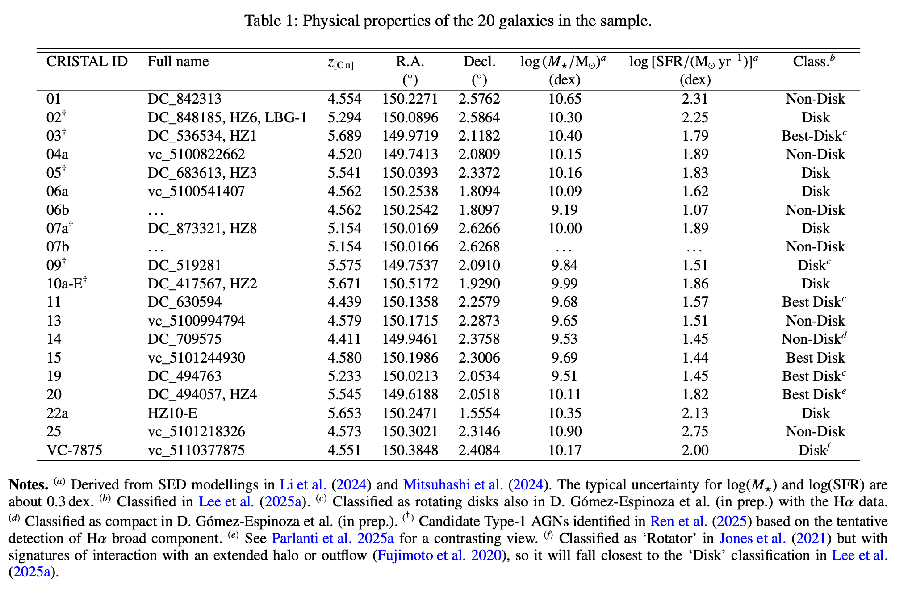

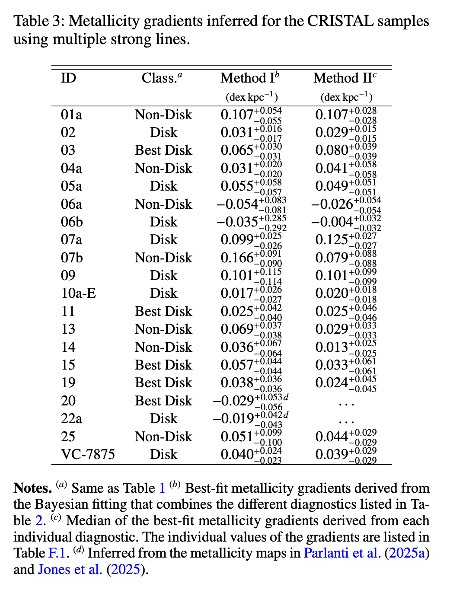

**[ALPINE-CRISTAL-JWST survey: revealing less massive black holes in high-redshift galaxies](https://arxiv.org/pdf/2509.02027).**

- Data/processing: JWST/NIRSpec IFU(3045)、NIRCam imaging、ALMA $[\mathrm{C\,II}]\,158\,\mu\mathrm{m}$；在 NIRCam photometric peak aperture 提取 IFU spectrum，拟合 H$\alpha$ narrow/broad components，用 broad H$\alpha$ 判断 type-I AGN candidates，估计 $M_{\rm BH}$ 和 $\lambda_{\rm Edd}$。
- Result: 这篇指出 ALPINE-CRISTAL 样本中有 7 个 type-I AGN candidates，因此后续做 IFU metallicity gradient 时需要显式处理 broad H$\alpha$ 和 AGN contamination。文章的核心结论是这些 candidates 的 $M_{\rm BH}$ 较低，整体不像许多高红移 over-massive BH，而更接近或低于本地 $M_{\rm BH}-M_*$ 关系。
- Properties: 7 个 type-I AGN candidates；$M_{\rm BH}\sim10^6-10^{7.5}\ M_\odot$，host $M_*$ 约 $10^{9.5}-10^{10.5}\ M_\odot$。AGN candidates的性质：
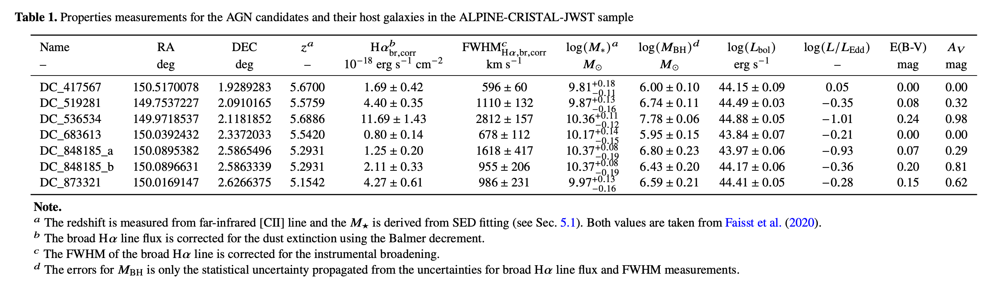

## Program 5974: ORCHIDS: ORigin of the [C II] Halos In Distant Systems
**Target.** 
- Proposal science target(s): Cristal-05; Cristal-07c; Cristal-09; Cristal-10; Cristal-21. 
- Physical type: **LBG**. 
- Redshift: $5.1 < z < 5.7$.

**JWST setup.** 
- Instrument: NIRSpec/IFU. Grating/filter: G395H/F290LP; G395M/F290LP. 
- Science Time: ~43.18h
- Available indicators: N2; O3N2; R3; S2.

**Published results and properties.** 

**[The ALPINE-CRISTAL-JWST Survey: JWST/IFU Optical Observations for 18 Main-Sequence Galaxies at z = 4 - 6](https://arxiv.org/pdf/2603.13493).**
和PID 3045的一样

## (2) Program 1893: Galaxy Assembly at z > 6: Unraveling the Origin of the Spatial Offset between the UV and FIR Emission
**Target.** 
- Proposal science target(s): BDF3299; COSMOS24108; A2744-YD4. 
- Physical type: **star-forming、多成分的高红移星系系统，其中至少部分位于原星系团中.**  
- Redshift: 7.114; 6.361; 7.879.

**JWST setup.** 
- Instrument: NIRSpec/IFU. Grating/filter: PRISM/CLEAR. 
- Science Time: ~21.3h
- Available indicators: N2; O3N2; R23; R3; O2; Ne3O2; O32; S2.

**Published results and properties.**

**[Gas-phase metallicity gradients in galaxies at z~6-8](https://arxiv.org/pdf/2403.03977).**

- Data/processing: JWST/NIRSpec IFU, NIRCam/ALMA ancillary data；拟合发射线，radial/bin-based metallicity-gradient fitting；indicator：R2、O3、Ne3O2、S2、R23
- Result: **得到了二维emission line map和radial metallicity gradient。** 主要结论是这些早期系统的 gradients 整体接近平坦，说明 merger、outflow 或 supernova-driven mixing 可能已经显著抹平早期化学结构。
- Properties: 样本的子结构覆盖 $\log(M_*/M_\odot)\sim7.6-9.3$、SFR $\sim1-15\ M_\odot\ {\rm yr^{-1}}$、$12+\log({\rm O/H})\sim7.7-8.3$. 样本子结构的性质如下：
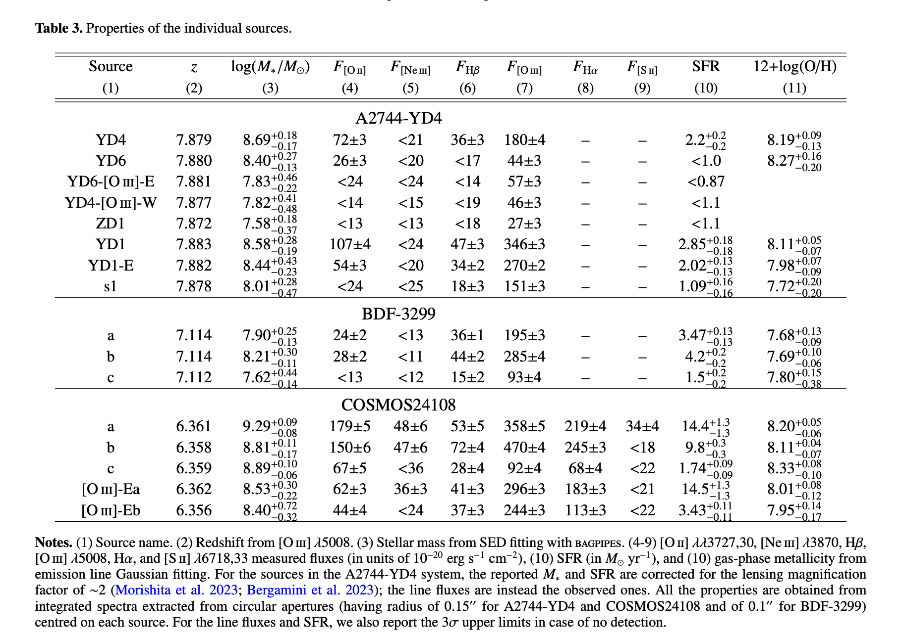

## (3) Program 1840: ALMA [OIII]88um Emitters. Signpost of Early Stellar Buildup and Reionization in the Universe
**Target.** 
- Proposal science target(s): J0235-0532; J0217-0208; SDF-LBG-ID34; RXC-J2248-ID3; COS-2987030247; SXDF-NB1006-2; BDF-3299; A2744-YD4; A1689-ZD1; J1211-0118; COS-3018555981; B14-65666. 
- Physical type: **[OIII]88um-selected active early galaxy sample**. 
- Redshift: 6 < z < 7.9

**JWST setup.** 
- Instrument: NIRSpec/IFU + NIRCam imaging(F115W/F150W/F200W+redshift-dependent LW filters). Grating/filter: G395H/F290LP or G395M/F290LP. 
- Science Time: ~33.9h
- Available indicators: target-dependent. For the lower-redshift targets, N2; O3N2; S2. For targets at $z\gtrsim6.7$, R23; R3; O2; Ne3O2; O32. Exact usable sets should be selected target by target.

**Published results and properties.** 有一些研究金属丰度的论文，但没有专门计算金属梯度

**[RIOJA. Young starburst and ionized gas outflows in a z=7.212 galaxy uncovered by JWST NIRCam and NIRSpec observations](https://arxiv.org/pdf/2510.25721).**

- Data/processing: JWST/NIRSpec IFU， NIRCam imaging，ALMA，MIRI；line-map extraction，kinematic/outflow decomposition。
- Result: **得到emission line map。** 发现[OIII]5008有宽线成分，解释为  ionized-gas outflow system；indicator: O2、R3、R23
- Properties: $\log(M_*/M_\odot)=8.54^{+0.79}_{-0.22}$；$\log[{\rm SFR}/(M_\odot\,{\rm yr^{-1}})]=2.54^{+0.17}_{-0.71}$；$12+\log({\rm O/H})_{\rm R23}=8.07\pm0.12$。

## (4) Program 1567: Early Galaxy Assembly Uncovered with ALMA and JWST: A Remarkably UV and [CII] Bright, Strongly Lensed Sub-L* Galaxy at z=6.072

**Target.** 
- Proposal science target(s): Group-Z6.3; Z6.1-6.2. 
- Physical type: **strongly lensed star-forming galaxy with dense clumps**. 
- Redshift: 6.072.

**JWST setup.** 
- Instrument: NIRSpec/IFU + NIRCam imaging(F115W、F150W、F277W、F356W、F444W). Grating/filter: G395H/F290LP. 
- Science Time: ~12.3h
- Available indicators: N2; O3N2; R3; S2; Te/direct.

**Published results and properties.** 

**[Primordial rotating disk composed of at least 15 dense star-forming clumps at cosmic dawn](https://arxiv.org/pdf/2402.18543).**

- Data/processing: JWST/NIRSpec， NIRCam， ALMA，  HST；IFU reduction，拟合发射线，得到line map，sed拟合，动力学分析，分析每个clump的性质。indicator: Te direct、R3、N2、O3N2、S2、O3S2。
- Result: **得到了emission line map**。利用JWST图像把一个在HST image中看起来较平滑的小星系，分解成了至少 15 个非常致密的恒星形成团块，底层结构是一个有序旋转的气体盘
- Properties: 整体的性质
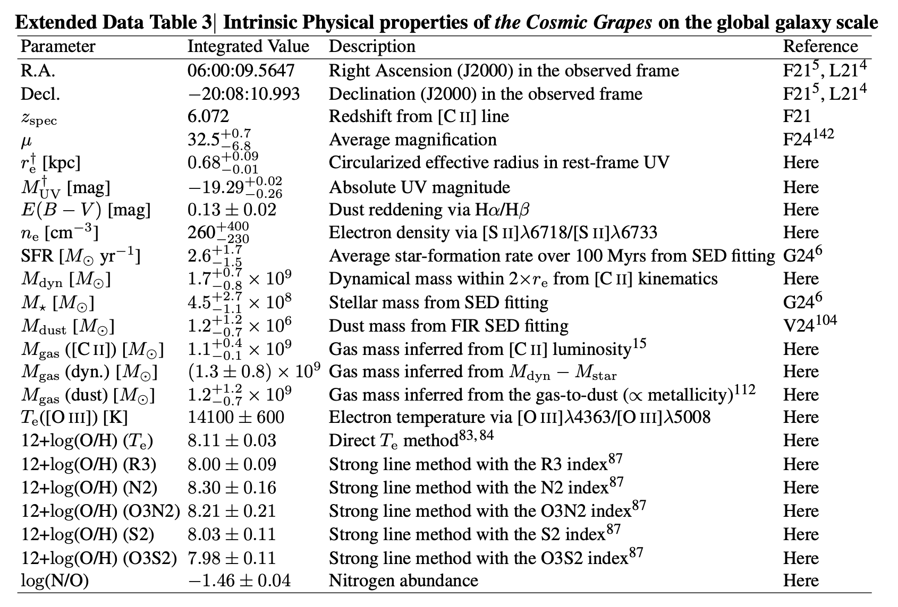​		

## (5) Program 1554: Nebular Line Diagnostics in a Merger at Cosmic Dawn

**Target.** 
- Proposal science target(s): Group-PJ308-21. 
- Physical type: **quasar host and two merging companions**. 
- Redshift: 6.234.

**JWST setup.** 
- Instrument: NIRSpec/IFU. Grating/filter: G395H/F290LP. 
- Science Time: ~7.8h
- Available indicators: N2; O3N2; R3; S2.

**Published results and properties.**

**[A quasar-galaxy merger at z~6.2: rapid host growth via accretion of two massive satellite galaxies](https://arxiv.org/pdf/2406.06697).**

- Data/processing: JWST/NIRSpec IFU， ALMA， HST；扣除了中心QSO的psf，做了line map和ne等性质的map，但没有量化梯度；indicator：Te direct、N2、R3、S2
- Result: **得到了emission line map**。把 PJ308-21 解释为 quasar host 正在吸积两个 massive satellites 的 merger system。三个星系的ISM差异较大，quasar host 已经很大质量，但由于merger还会快速增长
- Properties: QSO host的 $\log(M_*/M_\odot)\approx 11$，$Z_{\rm host}\approx 1.1\,Z_\odot.$

## (6) Program 1657: Anchoring z>6 Galaxy Metallicities Using Te and ne Diagnostics Enabled by JWST and ALMA Spectroscopy
**Target.** 
- Proposal science target(s): J0218-0519; J0217-0208; J1211-0118. 
- Physical type: **z>6 star-forming galaxies, with ALMA [O III] $88\,\mu{\rm m}$ detection**. 
- Redshift: 7.215, 6.204, 6.029.

**JWST setup.** 
- Instrument: NIRSpec/IFU + MIRI/MRS + NIRCam imaging(F150W + F300M；F200W + F410M; F150W + F360M；F200W + F430M). Grating/filter: G235H/F170LP; G395H/F290LP; G395M/F290LP; MIRI MRS Channel 1 SHORT(A). 
- Science Time: ~23.7h
- Available indicators: target-dependent. Oxygen-line diagnostics: R23; R3; O2; Ne3O2; O32; Te/direct. N2; O3N2; S2 are available only for targets with $z\lesssim7.0$.

**Published results and properties.**

**[JWST & ALMA Joint Analysis with [OII]3726,3729, [OIII]4363, [OIII]88um, and [OIII]52um: Multi-Zone Evolution of Electron Densities at z ~ 0 - 14 and Its Impact on Metallicity Measurements](https://arxiv.org/pdf/2505.09186).**

- Data/processing: NIRSpec/IFU + NIRCam imaging + ALMA $[\mathrm{O\,III}]\,88\,\mu{\rm m},[\mathrm{O\,III}]\,52\,\mu{\rm m}$; 发射线拟合,电子密度计算; indicator: Te direct、R23
- Result: **得到了line map**。光学线测得的电子密度随红移上升，但是FIR 线测得的电子密度却没有明显演化，说明它们主要追踪不同的气体成分。 传统的Te方法得到的金属丰度可能被低估，更偏向trace较热、较高密度的气体，不能代表整个星系。
- Properties: metallicity分别为: $Z_{\rm gas}\approx 0.32\,Z_\odot, 0.20\,Z_\odot,0.66\,Z_\odot.$
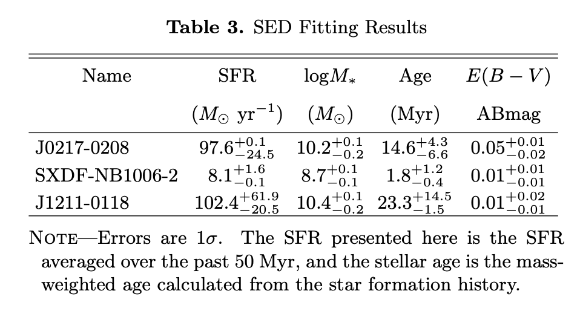

## (7) Program 1827: NIRSpec Integral Field Spectroscopy of LyC-Leaking Galaxies
**Target.** 
- Proposal science target(s): LACES94460; LACES104037. 
- Physical type: **LyC-leaking galaxy candidates**. 
- Redshift: 3.1

**JWST setup.** 
- Instrument: NIRSpec/IFU. Grating/filter: G235M/F170LP.
- Science Time: ~24.1h
- Available indicators: N2; O3N2; R3; S2. The O32 value discussed in the related paper should be checked against the observing configuration or ancillary data before being attributed to this IFU setup.

**Published results and properties.**

**[Confirmation and Refutation of Lyman Continuum Leakers at z~3 with JWST NIRSpec/IFU](https://arxiv.org/pdf/2603.05907).**

- Data/processing: JWST/NIRSpec IFU (1827) + HST imaging; 确认LyC信号区域，拟合发射线，星族建模; indicator: Te direct、S2、O32
- Result: **得到了line map**。确认了LyC leaker区域为LACES-10403，该区域由一个年龄仅约 $5 \text{ Myr}$ 的极年轻星族驱动，merger 可能为 LyC photon escape 提供通道
- Properties: 
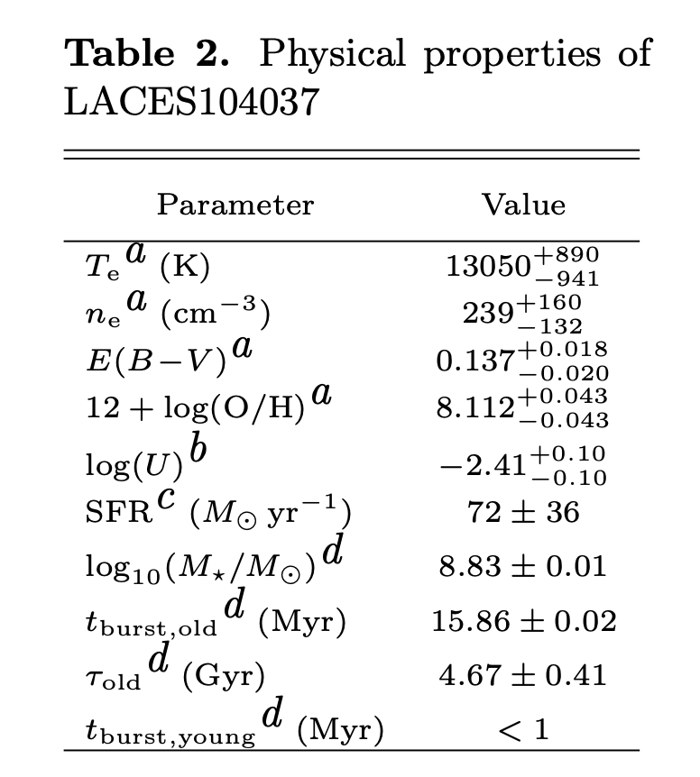

## (8) Program 2913: Dissecting the Monsters: Resolved IFU Spectroscopy of the Most Massive Quiescent Galaxies at z>3
**Target.** 
- Proposal science target(s): XMM-VID3-1120; XMM-VID3-2457; XMM-VID1-2075. 
- Physical type: **massive quiescent galaxy sample**. 
- Redshift: 3.4863, 3.4868, 3.4465.

**JWST setup.** 
- Instrument: NIRSpec/IFU. Grating/filter: G235M/F170LP. 
- Science Time: ~19.4h
- Available indicators: N2; O3N2; R23; R3; O2; Ne3O2; O32; S2.

**Published results and properties.**

**[MAGAZ3NE: Spatially Resolved Ages and Chemical Abundances of Ultra-Massive Quiescent Galaxies at z ~ 3.5 using JWST/NIRSpec IFU](https://arxiv.org/pdf/2605.27555).**

- Data/processing: JWST/NIRSpec IFU(2913)，Keck spectrum， ALMA dust continuum; 由于是QG，主要拟合不同半径处的吸收谱; indicator: $[\alpha/\mathrm{Fe}]$
- Result: **得到了[Fe/H] Map和金属梯度**。三个星系中心都经历过强烈 starburst，中心区域均较年轻，并且 $\alpha$-enhanced
- Properties: $\log(M_\star/M_\odot)>11.2$, 

## (9) Program 5293: Galactic Winds in the Early Universe: observing outflows in emission and absorption in a typical z~6 galaxy
**Target.** 
- Proposal science target(s): MACS0308-ZD1. 
- Physical type: **strongly lensed clumpy z=6.2 star-forming galaxy( Cosmic Spear)**. 
- Redshift: 6.208

**JWST setup.** 
- Instrument: NIRSpec/IFU + NIRCam imaging(F115W, F150W, F200W, F250M, F300M, F410M). Grating/filter: G395H/F290LP; G235H/F170LP; G140H/F100LP. 
- Science Time: ~10.64h
- Available indicators: N2; O3N2; R23; R3; O2; Ne3O2; O32; S2.

**Published results and properties.** 

**[Spatially Resolved Physical Properties of Young Star Clusters and Star-forming Clumps in the Brightest z>6 Galaxy， the Strongly Lensed Cosmic Spear at z=6.2](https://arxiv.org/pdf/2512.08054).**

- Data/processing: JWST/NIRSpec IFU(5293)， NIRCam imaging， ALMA， HST；发射线提取，sed拟合；
- Result: **得到了line map**。这篇的主要贡献是给强透镜系统的放大率、source-plane morphology 或 clump decomposition。IFU数据具体处理和金属丰度分析in prep
- Properties:
  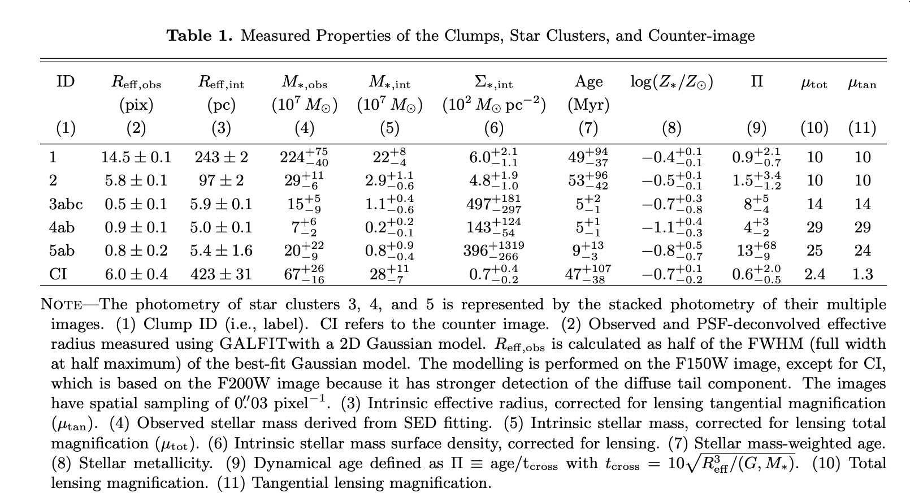

## (10) Program 1970: Zooming into the Monster's Mouth: Tracing Feedback from Their Hosts to Circumgalactic Medium in z=3.5 Radio-loud AGN
**Target.** 
- Proposal science target(s): TNJ0205+2242; TNJ0121+1320; 4C03.24; 4C19.71. 
- Physical type: **z~3.5 radio-loud AGN with jet**. 
- Redshift: 3.50 < z < 3.59.

**JWST setup.** 
- Instrument: NIRSpec/IFU. Grating/filter: G235H/F170LP. 
- Science Time: ~24.5h
- Available indicators: N2; O3N2; R23; R3; O2; Ne3O2; O32; S2.

**Published results and properties.** 目前论文主要做的动力学，没有做metallicity

**[JWST discovers an AGN ionization cone but only weak radiatively driven feedback in a powerful z~3.5 radio-loud AGN](https://arxiv.org/pdf/2401.02479).**

- Data/processing: JWST/NIRSpec， ALMA; 主要处理IFU数据，找companion并做了动力学建模 
- Result: 有[O III]5007 channel maps，追踪暖电离气体，最后通过动力学建模得到速度弥散。四个 radio AGN 周围都发现了 companions，可能主要对应 minor mergers，触发 radio AGN，并影响 jet
- Properties: $\log(M_\star/M_\odot)$在10.82-11.27

## (11) Program 2654: Kpc-scale Dual Supermassive Black Holes and Their Impact on Galaxy Formation at Cosmic Noon
**Target.** 
- Proposal science target(s): SDSS J0841+4825; SDSS J0749+2255. 
- Physical type: **kpc-scale dual quasar system**. 
- Redshift: 2.95, 2.17.

**JWST setup.** 
- Instrument: NIRSpec/IFU + MIRI/MRS. Grating/filter: G140M/F100LP; G235M/F170LP; MIRI MRS SHORT; MIRI MRS LONG. 
- Science Time: ~16.4h
- Available indicators: N2; O3N2; R23; R3; O2; Ne3O2; O32; S2.

**Published results and properties.** 

**[VODKA-JWST: Synchronized growth of two SMBHs in a massive gas disk? A 3.8 kpc separation dual quasar at cosmic noon with NIRSpec IFU](https://arxiv.org/pdf/2403.08098).**

- Data/processing: NIRSpec IFU(2654)；主要对SDSS J0749+2255双quasar处理，双psf subtraction，做二维发射线map
- Result: 得到了Hα、[SII]、[NII] flux map。首次直接探测到双 quasar 周围的延展电离气体
- Properties: $M_\star\sim10^{11}\ M_\odot$

## (12) Program 2959: Resolving early galaxy disks at z~8 with NIRSpec-IFS
**Target.** 
- Proposal science target(s): 04590; 06355; 10612. 
- Physical type: **weak lensed early galaxy disk candidates**. 
- Redshift: 7.66.

**JWST setup.** 
- Instrument: NIRSpec/IFU. Grating/filter: G395H/F290LP. 
- Science Time: not reported.
- Available indicators: R23; R3; O2; Ne3O2; O32; Te/direct.

**Published results and properties.**

**[Exploring Spatially-Resolved Metallicities, Dynamics and Outflows in Low-Mass Galaxies at z ~ 7.6](https://arxiv.org/pdf/2507.14936).**

- Data/processing: JWST/NIRSpec IFU(2959)， NIRCam imaging; 发射线拟合，计算金属丰度，动力学分析; indicator：O2、R3、Ne3O2、Te direct
- Result: **得到了line map和金属梯度**。使用strong-line得到的金属梯度~0，使用Te direct得到的金属梯度$\nabla_Z=-0.11\pm0.03\ {\rm dex\,kpc^{-1}}$，负梯度。作者认为可能原因包括: AGN ionization 污染了 strong-line ratios、strong-line calibration 不适用于 $z\sim7.6$、direct-$T_{\rm e}$ 方法中的 constant-density assumption 过于简单。
- Properties: 对于06355和10612分别为：$\log(M_\star/M_\odot)=8.72\pm0.04,8.08\pm0.04$，$SFR\sim54,15\,M_\odot\,{\rm yr}^{-1}$

## (13) Program 2566: Characterizing Stellar Mass Assembly and Physical Properties in the Brightest Galaxy in the Redshift>5 Universe
**Target.** 
- Proposal science target(s): J1241+2219. 
- Physical type: **highly magnified z=5 lensed galaxy**. 
- Redshift: 5.045.

**JWST setup.** 
- Instrument: NIRSpec/IFU + NIRCam imaging(F115W, F150W, F200W, F250M, F335M, F460M). Grating/filter: G395M/F290LP; G235M/F170LP. 
- Science Time: ~19.4h
- Available indicators: N2; O3N2; R23; R3; O2; Ne3O2; O32; S2.

**Published results and properties.**

**[JWST & the Waz Arc I: Spatially Resolving the Physical Conditions within a Post-Starburst Galaxy at Redshift 5 with NIRSpec IFS](https://arxiv.org/pdf/2512.02000).**

- Data/processing: NIRSpec/IFU(2566) + NIRCam imaging; 发射线提取，电离参数等性质分析; indicator：N2、O2、R23
- Result: **得到了 line map。** 它虽然在 UV 波段非常亮，但当前发射线整体较弱，Balmer absorption 很强，说明它曾经经历强烈的恒星形成，之后快速衰退；局部低金属丰度可能来自新鲜气体流入。
- Properties: $Z_{\rm gas}\approx0.5\,Z_\odot$，$\log(M_*/M_\odot)=9.7\pm0.3$
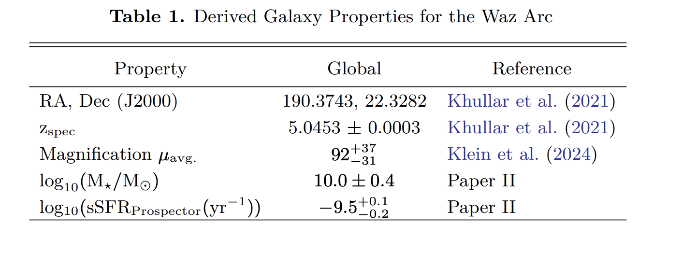

# 4. B 类: Non-lensed galaxy candidates without published metallicity gradients

## (14) Program 1626: Achieving a Revolutionary Panchromatic View of Early Galaxy Growth through NIRSpec/IFU Observations of 12 Massive z>6.5 Galaxies with ALMA-derived [CII] Redshifts
**Target.** 
- Proposal science target(s): REBELS-05; REBELS-08; REBELS-12; REBELS-14; REBELS-15; REBELS-25; REBELS-29; REBELS-32; REBELS-34; REBELS-38; REBELS-39. 
- Physical type: **UV 明亮、高质量恒星形成星系，都已经被 ALMA 探测到 [C II] $158\,\mu{\rm m}$ 发射线**. 
- Redshift: 6.5 < z < 7.7.

**JWST setup.** 
- Instrument: NIRSpec/IFU. Grating/filter: PRISM/CLEAR. 
- Science Time: ~14.1h
- Available indicators: target-dependent. R23; R3; O2; Ne3O2; O32 are available across the sample. H$\alpha$-based diagnostics such as N2 are available only for the lower-redshift subset and should be selected target by target.

**Published results and properties.**

**[REBELS-IFU: evidence for metal-rich massive galaxies at z~6-8](https://arxiv.org/pdf/2501.10559).**

- Data/processing: JWST/NIRSpec IFU(1626)，ALMA；提取光谱，金属丰度计算，scaling relation拟合(MZR和FMR)；indicators: R23、R3、N2、O32、O2、Ne3O2

- Result: **只得到了整体的金属丰度，没有line map**。显示这些高红移massive galaxies 已经有接近成熟的 metal enrichment

- Properties: 
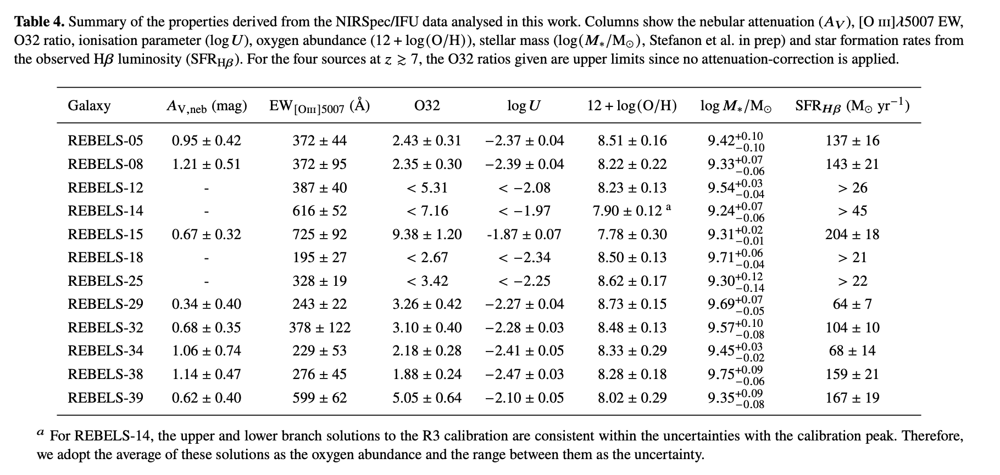

## (15) Program 5572: Red Monsters: Kinematics of Two 'Universe Breaking', Ultra-Massive Galaxies in the First Gyr

**Target.** 
- Proposal science target(s): S1; S2. 
- Physical type: **ultra-massive early red galaxy sample**. 
- Redshift: 5.58, 5.18

**JWST setup.** 
- Instrument: NIRSpec/IFU. Grating/filter: G395H/F290LP. 
- Science Time: ~16.8h
- Available indicators: R23; R3; O2; Ne3O2; O32.

**Published results and properties.** 下面的论文用到了这组观测，但没有关注金属丰度

**[From Grism to IFU: Revising the Redshift and Nature of the Massive Dusty Galaxy S1 with JWST and ALMA](https://arxiv.org/pdf/2602.03030).**

- Data/processing: JWST/NIRSpec IFU(5572)，ALMA; 只做了谱线识别和sed，没有做动力学和金属丰度
- Result: S1之前在FRESCO grism中认为红移是5.58，得到IFU数据后发现其实是3.244。
- Properties: 更新后的S1，$M=3.6\times10^{10}\,M_\odot$, $SFR=72\,M_\odot\,{\rm yr^{-1}}$
- Assessment for metallicity gradients: S1 修正为 $z=3.244$ 后，G395 setup 错过本报告关注的主要 rest-optical lines，不作为 metallicity-gradient 推荐对象。

## (16) Program 5761: Ionized Gas Kinematics of a z > 4 Main Sequence Disk Galaxy
**Target.** 
- Proposal science target(s): ALMA-J081740.86+135138.2. 
- Physical type: **massive rotating DLA host disk**. 
- Redshift: 4.26.

**JWST setup.** 
- Instrument: NIRSpec/IFU. Grating/filter: G395H/F290LP; G395M/F290LP. 
- Science Time: ~4.98h
- Available indicators: N2; S2.

**Published results and properties.** 还没有用这组观测的论文，下面这篇是用另一组IFU配置得到的结果，文中说这组观测的数据in prep

**[GA-NIFS: A smouldering disk galaxy undergoing ordered rotation at z = 4.26](https://arxiv.org/pdf/2512.05213v1).**

- Data/processing: NIRSpec/IFU(4258)，ALMA; line fitting，metallicity，动力学建模; indicator：N2、S2
- Properties: $Z_{\rm gas}\sim0.7\,Z_\odot,\ \log(M_\star/M_\odot)=10.6\pm0.2$

## (17) Program 6221: H-alpha mapping of a giant, prototypical Lyman-alpha blob at z=3
**Target.** 
- Proposal science target(s): LAB1IFU1. 
- Physical type: **giant Lyman-alpha blob**. 
- Redshift: 3.1.

**JWST setup.** 
- Instrument: NIRSpec/IFU. Grating/filter: G235M/F170LP. 
- Science Time: ~24.85h
- Available indicators: N2; O3N2; R3; S2.

**Published results and properties.** 还没有用到观测的论文
- Properties: 总分子气体质量$(8.7\pm2.0)\times10^{10}\,M_\odot$, 7个确认的星系

# 5. C 类: Lensed galaxy
## (18) Program 1864: The Formation of a Primeval Hyperstarburst Galaxy at z~6
**Target.** 
- Proposal science target(s): SPT0346-52. 
- Physical type: **strongly lensed dusty star-forming galaxy**. 
- Redshift: 5.6559.

**JWST setup.** 
- Instrument: NIRSpec/IFU + MIRI/MRS + MIRI imaging(F770W、F1280W、F1500W、F1800W、F2100W) + NIRCam imaging(F200W、F356W、F444W). Grating/filter: NIRSpec G395H/F290LP; MIRI MRS SHORT(A), MEDIUM(B). 
- Science Time: ~18.9h
- Available indicators: N2; O3N2; R3; S2.

**Published results and properties.** 目前没有使用该观测数据的论文
- Properties: $SFR\sim3000\text{--}4500\ M_\odot\,{\rm yr^{-1}},L_{\rm IR}\sim3.6\times10^{13}L_\odot$

## (19) Program 3433: Mapping star formation and feedback in clumpy galaxies at redshift ~5
**Target.** 
- Proposal science target(s): MS1358-ARC; MACS0940-ARC; RCS0224-ARC. 
- Physical type: **clumpy strongly lensed star-forming galaxy**. 
- Redshift:4.92, 4.03, 4.88

**JWST setup.** 
- Instrument: NIRSpec/IFU + NIRCam imaging. Grating/filter: G395H/F290LP; G235M/F170LP. 
- Science Time: ~38.2h
- Available indicators: N2; O3N2; R23; R3; O2; Ne3O2; O32; S2.

**Published results and properties.** 目前没有用这组观测的论文

- Properties: $M\sim10^6{-}10^9\ M_\odot$, UV-derived SFR: $0.1{-}1\ M_\odot\,{\rm yr}^{-1}$

## (20) Program 5119: Resolving galaxy building blocks at high-z: the comprehensive picture of internal physical properties in an ultra-low-mass major merger system at z=5.2
**Target.** 
- Proposal science target(s): ELG1+ELG2. 
- Physical type: **ultra-low-mass lensed major merger system**. 
- Redshift: 5.1.

**JWST setup.** 
- Instrument: NIRSpec/IFU. Grating/filter: G235M/F170LP. 
- Science Time: ~24.0h
- Available indicators: R23; R3; O2; Ne3O2; O32.

**Published results and properties.** 没有用这组观测的论文，但是有一个前置论文

**[JWST catches the assembly of a z~5 ultra-low-mass galaxy](https://arxiv.org/pdf/2212.07540).**

- Data/processing: NIRCam， HST
- Result: 作者认为 ELG1 和 ELG2 更可能是两个正在并合的星系，而不是一个星系内部的两个 clumps，因为 两个组件之间存在 Hα-bright bridge且rest-frame optical continuum 中可能有 tidal feature；
- Properties: 
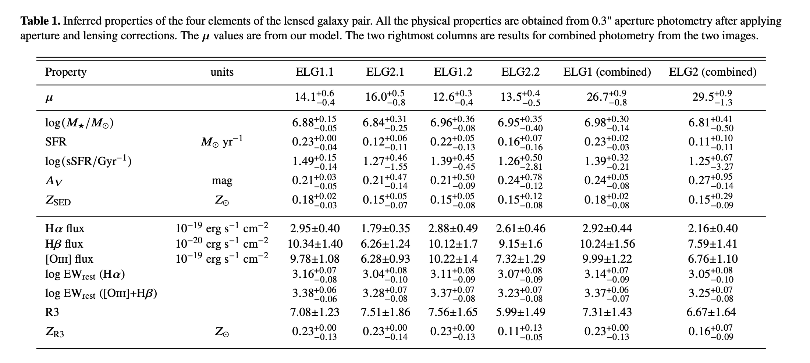

## (21) Program 5883: The most distant Cosmos-Web strong gravitational lens: mass content in the foreground lens and dissecting the background source
**Target.** 
- Proposal science target(s): CWeb-EinsteinRing. 
- Physical type: **strongly lensed background galaxy**. 
- Redshift: 5.1043.

**JWST setup.** 
- Instrument: NIRSpec/IFU. Grating/filter: G235H/F170LP. 
- Science Time: ~10.72h
- Available indicators: for the $z=5.1043$ background source, R23; R3; O2; Ne3O2; O32.

**Published results and properties.** 还没有用这组观测的论文
- Properties: background source stellar mass $\sim1.8\times10^{10}\,M_\odot$; IR-based SFR $\sim60\,M_\odot\,{\rm yr^{-1}}$.

## (22) Program 6405: Clumpy Relics: The First Spectroscopic Confirmation of Globular Clusters at z~3

**Target.** 
- Proposal science target(s): UNCOVER35602-Clumps; UNCOVER35602-Host. 
- Physical type: **lensed massive QG with surrounding clumps, 可能是cluster candidate**. 
- Redshift: 2.53.

**JWST setup.** 
- Instrument: NIRSpec/IFU. Grating/filter: PRISM/CLEAR. 
- Science Time: ~20.27h
- Available indicators: N2; O3N2; R23; R3; O2; Ne3O2; O32; S2.

**Published results and properties.** 没有用到该观测论文
- Properties: Stellar mass约 $10^6{-}10^7\,M_\odot$

# 6. D 类: AGN / quasar / radio galaxy
## (23) Program 1712: JWST Beholds the Multiple-merger Assembly of the Most Luminous Quasar
**Target.** 
- Proposal science target(s): W2246-0526. 
- Physical type: **hyperluminous obscured quasar / merger**. 
- Redshift: 4.6.

**JWST setup.** 
- Instrument: NIRSpec/IFU + MIRI/MRS. Grating/filter: NIRSpec G235H/F170LP + G395H/F290LP; MIRI MRS SHORT(A), MEDIUM(B), LONG(C). 
- Science Time: ~23.3h
- Available indicators: N2; O3N2; R23; R3; O2; Ne3O2; O32; S2.

**Published results and properties.** 目前的论文只用了MIRI/MRS的, 且没有做金属丰度相关的

**[JWST observations and a model for the extremely luminous obscured quasar W2246-0526 at z=4.6](https://arxiv.org/pdf/2605.09078).**

- Data/processing: MIRI/MRS; 主要用MIRI的数据帮助做不同model的sed拟合, 没有做金属丰度的处理
- Result: 最终通过sed拟合得到了各种性质。sed拟合中需要加上hot polar-dust component效果才好
- Properties: SFR $=360-2900\ M_\odot\,{\rm yr^{-1}}$；$M_{\rm BH}=(1.3-2.3)\times10^{10}\ M_\odot$，$M_{\rm *}\sim5\times10^{11}\ M_\odot$。

## (24) Program 2028: Mapping a Distant Protocluster Anchored by a Luminous Quasar in the Epoch of Reionization
**Target.** 
- Proposal science target(s): J0910Q; J0910m0414_all_objects_new. 
- Physical type: **Luminous broad-absorption-line quasar**. 
- Redshift: 6.63.

**JWST setup.** 
- Instrument: NIRSpec/IFU + NIRSpec/MOS. Grating/filter: NIRSpec IFU G395H/F290LP; PRISM/CLEAR for quasar-host continuum. 
- Science Time: ~16.3h
- Available indicators: N2; O3N2; R23; R3; O2; Ne3O2; O32; S2.

**Published results and properties.** 有使用MOS的论文，但没有使用IFU

- Properties: $M_{\rm BH}=(3.59\pm0.61)\times10^9\,M_\odot$, 位于 protocluster，富气体、尘埃; ${\rm FWHM}_{[\mathrm{C\,II}]\,158\,\mu{\rm m}}\approx930\ {\rm km\,s^{-1}}$.

## (25) Program 2249: Monster in the Early Universe: Unveiling the Nature of a Dust Reddened Quasar Hosting a Ten-Billion Solar Mass Black Hole at z=7.1
**Target.** 
- Proposal science target(s): J0038-0653. 
- Physical type: **dust-reddened high-redshift quasar**. 
- Redshift information from proposal_text: proposal redshift: 7.1; 7.06.

**JWST setup.** 
- Instrument: NIRSpec/IFU + MIRI imaging(F560W, F770W, F1000W, F1130W, F1280W, F1500W, F1800W, F2100W, F2550W). Grating/filter: G395H/F290LP; G395M/F290LP; PRISM/CLEAR. 
- Science Time: ~5.5h
- Available indicators: R23; R3; O2; Ne3O2; O32.

**Published results and properties.** 目前没有用到这个观测数据的论文，in prep

- Properties: 估计的$M_{\rm BH}\gtrsim10^{10}\,M_\odot.$ 

## (26) Program 2457: Extreme Quasar Feedback at the Peak of the Galaxy Formation Epoch
**Target.** 
- Proposal science target(s): SDSS-J221524.00-005643.8; SDSS-J083200.20+161500.3; SDSS-J083448.48+015921.1; SDSS-J123241.73+091209.3; SDSS-J121704.70+023417.1. 
- Physical type: **extremely red quasar outflow sample**. 
- Redshift: 2.40 < z < 2.59.

**JWST setup.** 
- Instrument: NIRSpec/IFU. Grating/filter: G235H/F170LP. 
- Science Time: ~20.9h
- Available indicators: N2; O3N2; R3; S2.

**Published results and properties.** 没有关注金属丰度/梯度的，主要看 quasar host 的连续谱

**[JWST IFU observations uncover host galaxy continua in extremely red and obscured quasar](https://arxiv.org/pdf/2506.12124).**

- Data/processing: JWST/NIRSpec IFU(2457, 1335)；quasar PSF subtraction,拟合形态并提取、拟合host一维光谱
- Result: 得到host的一维光谱、形态参数、性质。看到了quasar host的连续谱，发现quasar 与 host 中心经常不重合
- Properties: 
    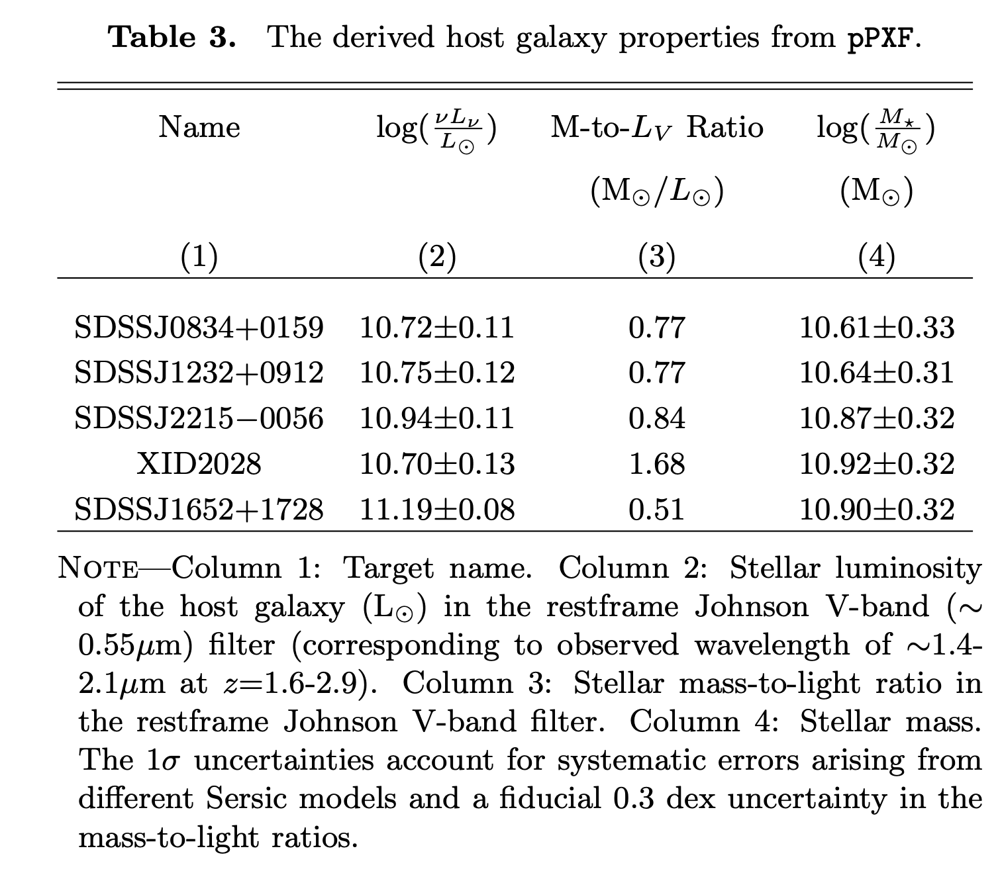

## (27) Program 3079: BEES: Black hole Extended Emission Search
**Target.** 
- Proposal science target(s): J1335+3533; J158-14; J2100-1715; J2229+1457. 
- Physical type: **luminous quasar,with small proximity zone**. 
- Redshift: 5.90 < z < 6.15.

**JWST setup.** 
- Instrument: NIRSpec/IFU. Grating/filter: G395M/F290LP. 
- Science Time: ~19.64h
- Available indicators: N2; O3N2; R3; S2.

**Published results and properties.** 没有专门测量金属丰度/梯度

**[BEES: Quasar lifetime measurements from extended rest-optical emission line nebulae at z ~ 6](https://arxiv.org/pdf/2510.09753).**

- Data/processing: JWST/NIRSpec IFU(3079, 1218)；psf subtraction，制作pseudo-narrowband image，估计lifetime
- Result: 得到了Hα、[OIII] pseudo-narrowband image。发现多数 quasars 当前 UV-bright phase 很短
- Properties: $M_{\rm BH}\sim10^9\,M_\odot$

## (28) Program 3084: First spatially resolved characterization of a radio-driven outflow at z~6
**Target.** 
- Proposal science target(s): P352-15. 
- Physical type: **radio-loud quasar with jet-driven outflow**. 
- Redshift : 5.83.

**JWST setup.** 
- Instrument: NIRSpec/IFU. Grating/filter: G395H/F290LP. 
- Science Time: ~13.97h
- Available indicators: N2; O3N2; R3; S2.

**Published results and properties.** 目前没有使用该观测数据的论文
- Properties: $M_{\rm BH}\sim10^9\,M_\odot$

## (29) Program 5192: The first multi-scale and multi-phase characterization of black hole feedback at z>6
**Target.** 
- Proposal science target(s): J0923+0402. 
- Physical type: **low-ionization broad-absorption-line quasar**. 
- Redshift: 6.626.

**JWST setup.** 
- Instrument: NIRSpec/IFU. Grating/filter: G395M/F290LP. 
- Science Time: ~7.1h
- Available indicators: N2; O3N2; R3; S2.

**Published results and properties.** 目前没有使用这个观测的论文
- Properties: $\log(M_{\rm BH}/M_\odot)=9.4,\log(L_{\rm bol}/{\rm erg\,s^{-1}})=47.5$, 有延伸达 15 kpc、包裹着整个宿主星系的巨型 [CII] 气体晕

## (30) Program 4877: The Host Galaxy, Environment, and Hot Dust Emission of the First Known Extremely-Luminous Obscured AGN at z>6
**Target.** 
- Proposal science target(s): COS-87259. 
- Physical type: **obscured hyperluminous radio-loud AGN with dust-obscured starburst**. 
- Redshift: 6.853.

**JWST setup.** 
- Instrument: NIRSpec/IFU + MIRI imaging(F560W, F770W,F1000W,F1130W,F1280W,F1500W,F1800W,F2100W,F2550W) + NIRCam WFSS(F410M). Grating/filter: PRISM/CLEAR. 
- Science Time: ~7.21h
- Available indicators: N2; O3N2; R23; R3; O2; Ne3O2; O32.

**Published results and properties.** 目前没有使用该观测数据的论文
- properties: $M_*\sim 10^{10.24}{-}10^{11.2}\,M_\odot,L_{IR}\sim 9\times10^{12}\,L_\odot,SFR\sim1300\,M_\odot\,{\rm yr^{-1}}$

## (31) Program 4912: Mapping the multi-phase outflows in z~6 luminous quasars
**Target.** 
- Proposal science target(s): J1148+5251; P183+05; J1319+0950; J2310+1855; J2054-0005. 
- Physical type: **z~6 luminous quasar outflow sample**.
- Redshift: 6.003 < z < 6.419.

**JWST setup.** 
- Instrument: NIRSpec/IFU. Grating/filter: G395H/F290LP.
- Science Time: 15.32h
- Available indicators: N2; O3N2; R3; S2.

**Published results and properties.** 目前没有使用该观测数据的论文
- Properties: $M_{\rm BH}\sim3.0\times10^9\,M_\odot$

## (32) Program 6074: The First Measurement of AGN Feedback in Action in the First Billion Years
**Target.** 
- Proposal science target(s): COSMOSVLA-J100104.51+020203.6. 
- Physical type: **heavily obscured radio-loud AGN candidate**. 
- Redshift: 7.7.

**JWST setup.** 
- Instrument: NIRSpec/IFU. Grating/filter: G395M/F290LP. 
- Science Time: 6h
- Available indicators: R23; R3; O2; Ne3O2; O32.

**Published results and properties.** 目前没有使用该观测数据的论文
- Properties: $\log(M_\star/M_\odot)=11.92\pm0.50,M_{\rm BH}\gtrsim6.4\times10^8\,M_\odot$

# 7. Recommendation

A 类用于建立方法基准；B/C 类用于寻找新的 star-forming galaxy metallicity-gradient science；D 类需要注意 AGN 的影响

## 7.1 Published benchmarks

| program ID | role | why it matters |
|---|---|---|
| 3045 | Standard gas-phase gradient benchmark | 20 个 $4<z<6$ main-sequence galaxies 已经得到 gas-phase abundance gradients，适合作为 reduction、line fitting 和 calibration comparison 的方法基准。 |
| 1893 | Early-universe resolved gradient benchmark | $z\sim6-8$ systems 已有二维 emission-line maps 和 radial metallicity gradients，适合研究 merger、outflow 和 mixing 对早期化学结构的影响。 |
| 2959 | High-redshift calibration stress test | $z\sim7.6$ low-mass galaxies 已有 resolved maps；strong-line gradient 接近 0，而 direct-$T_{\rm e}$ 得到 $\nabla_Z=-0.11\pm0.03\ {\rm dex\,kpc^{-1}}$，可检验高红移 strong-line calibration。 |

## 7.2 B 类: non-lensed galaxy recommendations

| rank | program ID | target | useful indicators | why recommended | main caveat |
|---|---|---|---|---|---|
| 1 | 1626 | REBELS $z>6.5$ galaxy sample | R23; R3; O2; Ne3O2; O32; target-dependent N2 | 非透镜高红移样本，适合统计性 resolved enrichment 分析，并可连接已有 integrated metallicity 结果。 | PRISM 分辨率有限；H$\alpha$ diagnostics 只能用于较低红移子样本。 |
| 2 | 5761 | ALMA-J081740.86+135138.2 | N2; S2 | 旋转盘几何结构清楚，适合径向 profile 和 gradient 验证。 | indicator 较少，主要依赖 N2；需谨慎处理 N/O 和 calibration scatter。 |
| 3 | 6221 | LAB1IFU1 | N2; O3N2; R3; S2 | 适合研究 LAB 环境中的 line map、component contrast 和 abundance structure。 | 不是普通 disk-gradient 样本，应优先讨论环境和不同组件之间的差异。 |

## 7.3 C 类: lensed galaxy recommendations

| rank | program ID | target | useful indicators | why recommended | main caveat |
|---|---|---|---|---|---|
| 1 | 3433 | MS1358-ARC; MACS0940-ARC; RCS0224-ARC | N2; O3N2; R23; R3; O2; Ne3O2; O32; S2 | 多个 clumpy strongly lensed arcs，indicator 丰富，最适合 source-plane clump-scale abundance mapping。 | 需要 lens model、source-plane reconstruction 和 clump matching。 |
| 2 | 5119 | ELG1+ELG2 | R23; R3; O2; Ne3O2; O32 | 适合比较 merger components 和 H$\alpha$-bright bridge 的 abundance contrast。 | 不应强行解释为单一径向 gradient。 |
| 3 | 5883 | CWeb-EinsteinRing background source at $z=5.1043$ | R23; R3; O2; Ne3O2; O32 | 高放大背景源适合 source-plane abundance mapping。 | 只讨论背景源；需要可靠 lens reconstruction。 |

## 7.4 D 类: AGN / feedback recommendations

| rank | program ID | target | useful indicators | why recommended | main caveat |
|---|---|---|---|---|---|
| 1 | 1712 | W2246-0526 | N2; O3N2; R23; R3; O2; Ne3O2; O32; S2 | Obscured quasar merger，适合比较 host、companions 和不同 ionization zones。 | 必须做 AGN subtraction等处理。 |
| 2 | 2028 | J0910Q protocluster system | N2; O3N2; R3; S2 | 适合研究 NLR、host 和 companions 的 ionization-abundance structure。 | Quasar PSF 和 NLR contamination 明显。 |
| 3 | 4877 | COS-87259 | R23; R3; O2; Ne3O2; O32 | PRISM/CLEAR 覆盖广，适合探索 obscured radio-loud AGN 的 abundance-ionization mapping。 | AGN 和 dusty starburst 污染需要联合建模。 |

